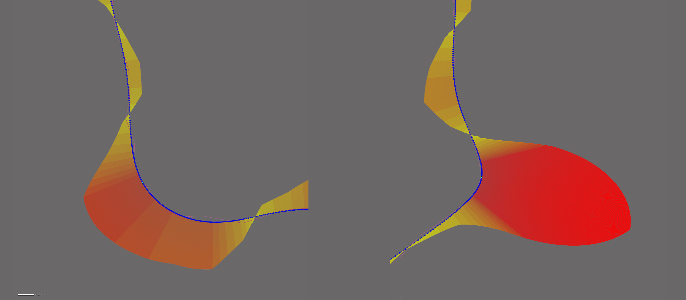
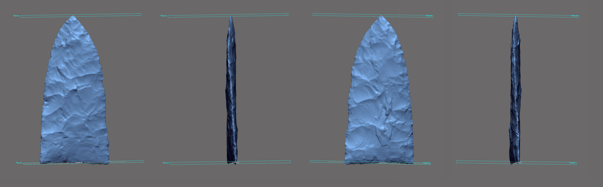
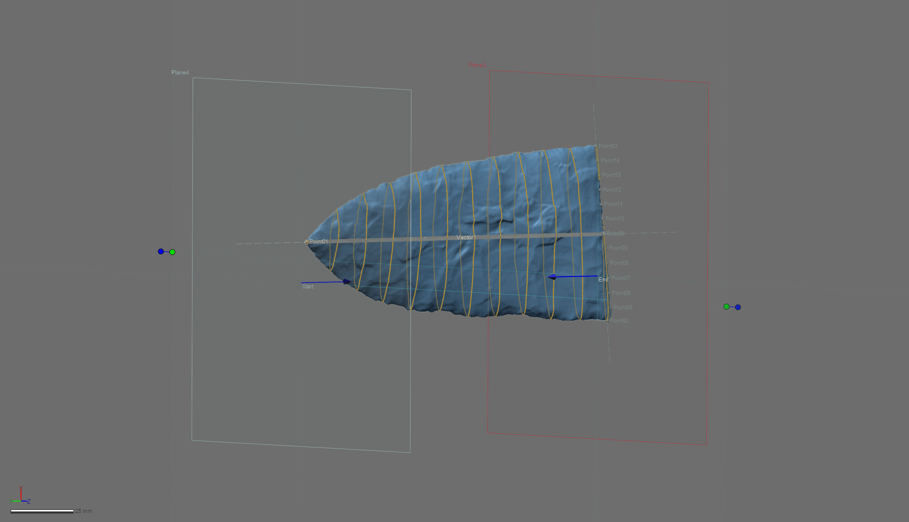

```{r setup, include=FALSE}
knitr::opts_chunk$set(echo = TRUE)
```

The landmarking protocol (`LM3d2`) developed for this project represents a substantial methodological advancement when contrasted with those protocols used in previous geometric morphometric studies of Gahagan biface morphology [@RN11783;@RN21001]. This protocol represents the continued evolution of a research program concerned with the development of a rigorous and replicable three-dimensional (3D) landmarking workflow, which simultaneously takes into account the unique and complex design elements associated with individual bifaces. Landmark (LM) and semilandmark (sLM) placement was achieved through the construction of reference geometry in _Geomagic Design X (Build Version 2020.0.2 [Build Number: 55])_, used to expand upon the previous LM configuration, and capitalise upon additional design attributes. 

Reference geometry provides the requisite foundation needed to apply the LM and sLM points at mathematically-defined locations. The result is a LM and sLM configuration that articulates with specific morphological features (plan views, profiles, and cross-sections), which have demonstrated utility in wide-ranging studies of biface and projectile point morphology.

## Foundations

The initial landmarking protocol used by Selden and colleagues [-@RN11783] enlisted a curve that was projected onto a 2D plane. That protocol provided the framework needed to begin a more thorough consideration of 3D landmarking protocols, driving the evolution of the protocol described here.

```{r fig.gahaganmorph, fig.cap="The landmarking protocol used in the 2D analysis of Gahagan bifaces, where all landmarks and semilandmarks were projected onto a plane."}
knitr::include_graphics('images/gahaganmorph.jpg')
```

The first 3D landmarking protocol ([`LM3d1`](https://github.com/aksel-blaise/gahaganmorph2/blob/master/analysis/landmarking-protocol.md)) was used in an analysis of Gahagan bifaces focused only upon the plan view (lateral/basal edges), and enlisted _auto3dgm_ [@RN8343] to achieve the principal alignments needed to assign the front and back to each biface [@RN21001]. While basic, this landmarking protocol generated the requisite framework needed to begin constructing different suites of design-based `reference geometry` that can be tailored to address specific research questions.

```{r fig.gahaganmorph2, fig.cap="The first [3D landmarking protocol](https://github.com/aksel-blaise/gahaganmorph2/blob/master/analysis/landmarking-protocol.md) (`LM3d1`) used to analyse Gahagan bifaces, which captured those attributes associated with axial twisting."}
knitr::include_graphics('images/gahaganmorph2.png')
```

The goal of this landmarking protocol was to increase the precision and rigour of the study by including additional elements from the Z-dimension to capture additional characteristics associated with plan, profile, and cross-section morphology. This landmarking protocol is the culmination of the iterative design process that began during the previous 2D [@RN11783] and 3D ([`LM3d1`](https://github.com/aksel-blaise/gahaganmorph2/blob/master/analysis/landmarking-protocol.md)) analyses  [@RN21001], and includes fewer steps than [`LM3d3`](https://aksel-blaise.github.io/dalton/landmarking-protocol-3d3.html), which was developed for a study of stemmed projectiles. 

The cross-sections increase the coverage of sLMs across mesh topology, providing for greater precision in the analysis of whole-object morphology, and can be subset as a means of analysing specific features of interest. For this study, the previously-noted morphological differences that occur in plan view [@RN11783;@RN21001] are further scrutinized in an effort to explore whether those differences in Gahagan biface plan view might be said to extend to the profiles of Gahagan bifaces. Due to the degree of axial twisting that occurs across the sample, it is not possible to gather the data needed to answer this query using 2D methods.

The continued evolution of this landmarking protocol represents a concerted effort to better comprehend the vagaries of morphological similarities and differences among Gahagan bifaces. While true that some landmarking protocols can be---and often are---recycled as new specimens are added, this research program endeavours to achieve ever-greater accuracy, precision, and rigour in each iteration.

## Generating the peripheral (plan view) spline

This effort begins with a spline extracted from the surface geometry of the mesh using the `extract contour curves` command. In reverse-engineering, `extract contour curves` is regularly employed as the first step in building a `patch network` to construct a surface. The extracted feature curve is rendered as a spline, and follows the highest curvature contours around the periphery of the lateral and basal edges, following the highly variable sinuous edge morphology around the entirety of each biface [@RN21001]. The remainder of the landmarking protocol is based upon this spline, which was subsequently split at four mathematically-defined locations [@RN21001].

```{r figspline, out.width = "100%", dpi = 300, echo=TRUE, warning=FALSE, fig.cap="Spline extracted along the highest contours of the projectile."}
knitr::include_graphics('images/extractspline.png')
```

### Splitting Spline 1

_`Reference geometries` are used in the assistance of creating other features. These include basic geometric entities, such as `planes`, `vectors`, `coordinates`, `points`, and `polygons`. A `reference point` is a virtual point and is used to mark a specific position on a model or in 3D space. A `reference plane` is a virtual plane that has a normal direction and an infinite size. A `reference plane` is not a surface body, and is used to create other features._ 

The characteristic points and tangents developed for this landmarking protocol were inspired by the work of Birkhoff [-@RN11786], and have been gainfully employed within the context of both ceramic [@RN11801;@RN11782;@RN11716;@RN20852] and lithic analyses [@RN11783;@RN21001]. 

#### Split Spline 1 at location of LM 01

The `horizontal tangent` was calculated by drawing a horizontal line above the tip of each biface using the tangent as a `common constraint`, and the `horizontal` as the `independent constraint`. To split the 3D spline at the location of the `horizontal tangent`, a `reference point` was inserted at the location of the `tangent` in the 2D sketch (light blue point; below, left), followed by a `reference plane` (in white; below, left and right) using the `pick point and normal axis` function where the `reference point` (h-tangent) was used as the `pick point`, and the `Right plane` as the `normal axis` (below, left). The 3D spline was cut at the location where the `reference plane` intersected with the spline (below image, right).

```{r figlm1, out.width = "100%", dpi = 300, echo=TRUE, warning=FALSE, fig.cap="Identify horizontal tangent, insert reference point and reference plane (left). Use reference plane to cut spline at the location of the horizontal tangent (right)."}
knitr::include_graphics('images/lm1.png')
```

#### Split Spline 1 at locations of LM 02 and LM 03

The point of highest curvature on either side of the basal edge was calculated using the `curvature` function in the Accuracy Analyzer. This function displays the curvature flow as a continuous color plot across the area of the curve. In this instance, _curvature_ is defined as the amount by which a geometric shape deviates from being flat or straight in the case of a line. Curvature is displayed in different colors according to the local radius, and calculated in only one direction (U or V) along the curve. Using this tool, the two points of highest curvature were located between the basal and lateral edges on either side of each projectile where the local radius measure was largest. The orientation of each biface was initially dictated by the _auto3dgm_ alignment in [`LM3d1`](https://github.com/aksel-blaise/gahaganmorph2/blob/master/analysis/landmarking-protocol.md)[@RN8343;@RN21001]; however, _`LM3d2` follows a different protocol._

```{r figcurve, out.width = "100%", dpi = 300, echo=TRUE, warning=FALSE, fig.cap="Identify points of hightest curvature (light blue) at left/right intersection of lateral and basal edges."}

```

#### Split Spline 1 at location of LM 04

One additional landmark (LM 04) was placed at the center of the base. The location of this landmark was identified by calculating the linear distance between LM 02 and LM 03, and projecting a `reference point` (ctrl-div; below) equidistant between the two. A `reference plane` was added using the ctrl-div as the pick point, and the `Right plane` as the `normal axis`. The spline was subsequently split at the intersection of the `reference plane` and the basal spline.

```{r figlm4, out.width = "100%", dpi = 300, echo=TRUE, warning=FALSE, fig.cap="Calculate linear distance between LM2 and LM3, insert reference plane coplanar to Right plane equidistant between LM2 and LM3, and use the reference plane to cut the spline."}
knitr::include_graphics('images/lm4.png')
```

## Reference geometry, Build 1

Each of the preceding protocols were used in the previous analysis of Gahagan bifaces [@RN21001] using [`LM3d1`](https://github.com/aksel-blaise/gahaganmorph2/blob/master/analysis/landmarking-protocol.md). The following sections detail the evolution of that landmarking protocol. The resulting constellation of LM and sLM points use a design-based constellation that can be subset to test a broad range of hypotheses associated with biface morphology, and can be extended to include specific or multiple components for each cross-section. While not a part of this analysis, each cross-section is also split between LM 01 and LM04, allowing for analyses of _bilateral asymmetry_ in both plan and profile views.

### Reference Vector 1, Point 2, and Plane 2

A linear `reference vector` (vector.1) was inserted between LM 01 and LM 04, and a `reference point` (ref.pt.2) was placed equidistant between LMs 02 and 03 along vector.1. The Z-coordinates of ref.pt.2 were altered to relocate it 15mm from vector.1 in the direction of the Z-axis, while otherwise maintaining its' alignment with vector 1. The `pick point and coplanar` function was used to place a `reference plane` (ref.pl.2) along vector.1 in the direction of ref.pt.2, bisecting the biface along the Z-axis---perpendicular to the lateral edges---between LM 01 and LM 04.

```{r vecptplane, out.width = "100%", dpi = 300, echo=TRUE, warning=FALSE, fig.cap="Vector.1 placed between LM 01 and 04, ref.pt.2 equidistant between the landmarks along vector.1. Z-coordinates altered to offset the point 15mm from vector.1 (left two images). Vector.1 and ref.pt.2 were used to place a ref.pl.2 coplanar to the vector in the direction of ref.pt.2 using the `pick point and coplanar axis` function (right two images)."}
knitr::include_graphics('images/vecptplane.png')
```

### Reference Planes 3 and 4

Using the same method, a `reference vector` (vector.2) was inserted between LM 02 and LM 03 using the same `reference point`. The Z-coordinates of ref.pt.3 were similarly altered to relocate it 15 mm from vector.2 in the direction of the Z-axis. The `pick point and coplanar axis` function was used to place a `reference plane` ref.pl.3 along vector.2 in the direction of ref.pt.3, bisecting the biface along the X-axis---parallel to the base---between LM 02 and LM 03. A fourth `reference plane` ref.pl.4 was inserted using the `pick point and normal axis` function, placing a plane at the intersection of LM 01 and vector.1. These two planes serve as the basis for the equidistant cross-sections. 

_**The angle between ref.pl.2 and ref.pl.3 was measured on each side of ref.pl.2, and the side with the lowest angle was kept on the right during the remainder of the landmarking process. LMs 02 and 03 were assigned following this calculation.**_

```{r plane3.4, out.width = "100%", dpi = 300, echo=TRUE, warning=FALSE, fig.cap="Vector placed between LM 01 and 04, ref.pt.2 equidistant between the landmarks along the vector, then the Z-coordinates were altered to offset the point 15mm from the vector (left two images). The vector and ref.pt.3 were subsequently used to place a plane coplanar to the vector in the direction of ref.pt.3 using the `pick point and coplanar axis` function. Plane 4 was inserted using the `pick point and normal axis` function with vector1 as the normal axis, and LM 01 as the pick point."}

```

## Cross-sections

Twelve equidistant curves were inserted between the ref.pl.3 and ref.pl.4 using the `section` function, and those that bisected the biface at the location of LM 01 and LM 04 were deleted. The resulting 10 curves were split at the points of highest curvature along the lateral edges, then along the mid-line at the point where they intersect with ref.pl.2.

```{r cross.10, out.width = "100%", dpi = 300, echo=TRUE, warning=FALSE, fig.cap="Ten equidistant cross-sections were inserted between Plane 3 and Plane 4."}

```

### Splitting the curves (Step 1)

Cross-sections were split at the intersection of each horizontal curve and ref.pl.2. The resulting `reference geometry` provides a means of analysing the contribution of bifacial morphology associated with the projectile's profile, and divides the landmarking configuration into two discrete components (plan and profile view) for use in the analysis.

```{r cut.cross.plane2, out.width = "100%", dpi = 300, echo=TRUE, warning=FALSE, fig.cap="Cross-sections were cut where they intersect with Plane 2, along the mid-line of the projectile between LM 01 and LM 04."}
knitr::include_graphics('images/cut.cross.plane2.png')
```

### Splitting the curves (Step 2)

Each curve was split at the two points of highest curvature along the lateral edges of the biface. These sLMs contribute to the analysis of the projectile in plan view, and follow the dynamic---and unique---3D contours associated with the lateral edge of each biface.

```{r pt.high.curv.split, out.width = "100%", dpi = 300, echo=TRUE, warning=FALSE, fig.cap="Spline splits (blue dots) along the lateral edges occur at the point of highest curvature. These splits occur at known coordinates used to add the semilandmarks."}
knitr::include_graphics('images/pt.high.curv.split.png')
```

## Landmark and semilandmark placement

Landmarks were placed at the locations of spline splits following the same protocol enlisted by the previous study (blue points, below) [@RN21001]. Two equidistant sLMs were added between LM 02 and LM 04, and between LM 04 and LM 03. Along the lateral edges, sLMs were numbered from the top right, then from top/front along the mid-line.

```{r figlmslm-all, out.width = "100%", dpi = 300, echo=TRUE, warning=FALSE, fig.cap="Reference geometry and 3D curves with landmarks (blue) and semilandmarks (white) applied."}
knitr::include_graphics('images/lmslm-allplanes.png')
```

Semilandmarks 49 - 88 were placed at locations equidistant along the curve of each cross section between the blade and the midline, and numbering begins moving from left to right across the front, then the back of the biface from the top to the bottom.

```{r all-applied-lmslm, out.width = "100%", dpi = 300, echo=TRUE, warning=FALSE, fig.cap="Reference geometry, 3D curves, and cross-sections with landmarks (blue) and semilandmarks (white) applied."}
knitr::include_graphics('images/all-applied-lmslm.png')
```

The resulting 3D constellation of LMs and sLMs can be parsed and divided to answer wide-ranging morphological questions related to Gahagan bifaces, marking a substantive advancement in the analysis of Gahagan biface morphology. The design of the `reference geometry` used in `LM3d2` is extensible, and the semilandmark configuration can be further expanded or contracted as required by the research question(s).

## References cited
